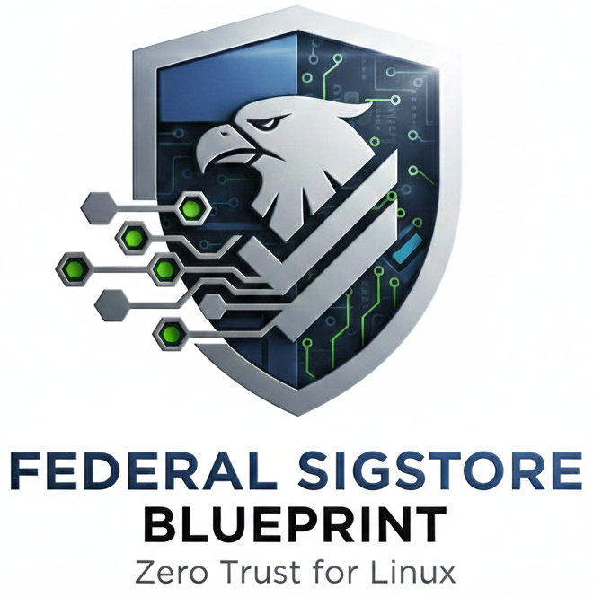
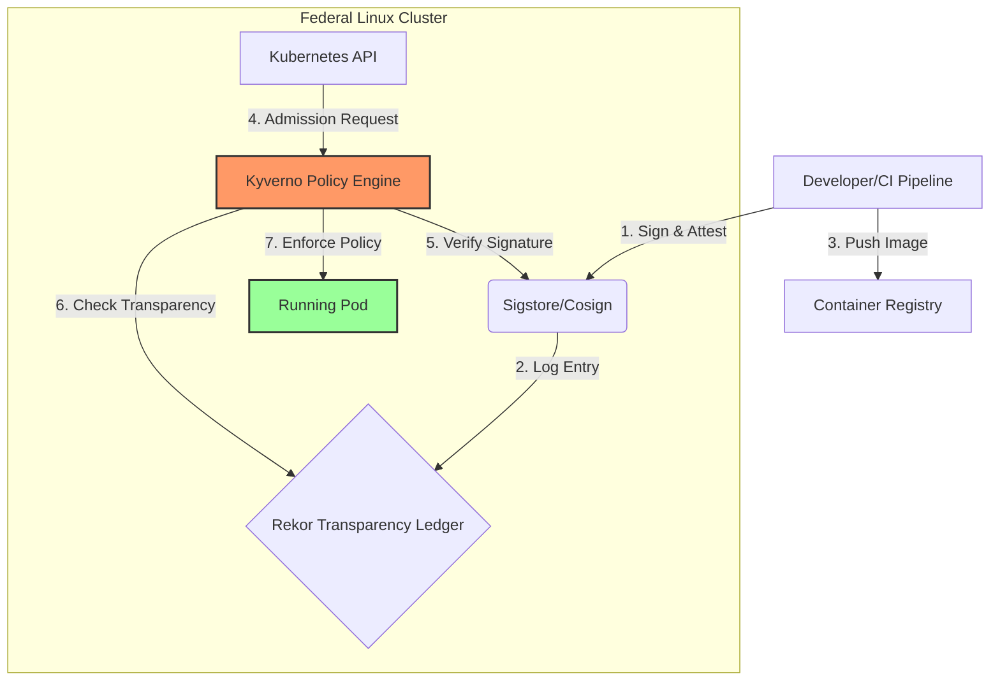

  

# Federal Sigstore Blueprint: Zero Trust for Linux

  
  
  

This repository provides a reference architecture and implementation framework for scaling **Sigstore (Cosign/Rekor)** within federal DevSecOps environments. 

## Key Features
* **Policy-as-Code:** Automated Kyverno policies for signature and SBOM enforcement.
* **Keyless Attestation:** Alignment with EO 14028 using OIDC identity.
* **Vulnerability Guardrails:** Enforcement of security thresholds before deployment.

## Structure
* `/policies`: Kyverno ClusterPolicies for admission control.
* `/pipeline`: Automation scripts for signing and attestation.
* docs/compliance-mapping.md: Mapping of policies to NIST 800-53 security controls.
