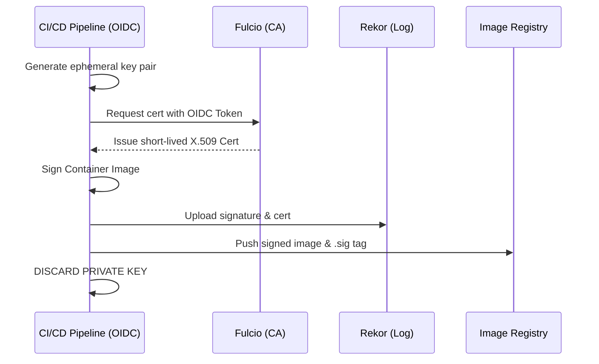

# Technical Deep Dive: Keyless Attestation 

Traditional code signing relies on long-lived private keys (GPG/RSA) that are difficult to rotate and easy to steal. This blueprint moves the federal "Root of Trust" from **something you have (a key)** to **something you are (an identity)**.

## The Three Pillars of Sigstore

The blueprint orchestrates three core services to achieve keyless security:

1. **Fulcio (The Certificate Authority):** - Issues short-lived X.509 certificates.
   - Binds a temporary public key to an **OIDC (OpenID Connect)** identity (e.g., your GitHub or Google account).
   - Certificates are valid for only **10 minutes**, eliminating the need for complex revocation lists.

2. **Rekor (The Transparency Log):** - An immutable, append-only ledger.
   - Every signing event is hashed and recorded. 
   - Provides "Proof of Inclusion," allowing auditors to verify that an image was signed during the certificate's 10-minute validity window.

3. **Cosign (The Orchestrator):** - The CLI tool that generates the ephemeral key pair in memory.
   - It sends the OIDC token to Fulcio, signs the artifact, and then **immediately discards the private key**.

---

## The Workflow Lifecycle

### 🪄 Next Steps
