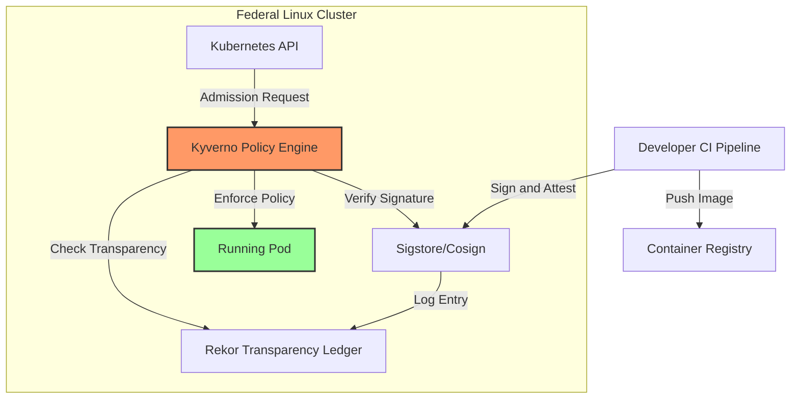

  

# Federal Sigstore Blueprint: Zero Trust for Linux

  
  
  

This repository provides a reference architecture and implementation framework for scaling **Sigstore (Cosign/Rekor)** within federal DevSecOps environments. 

## Introduction
### Institutionalizing Zero Trust and Software Supply Chain Security for Federal Linux Clusters

The Federal Sigstore Blueprint is an open-source reference architecture and implementation framework designed to scale Sigstore (Cosign/Rekor) within federal DevSecOps environments. It automates the "Verify-Before-Deploy" lifecycle, transforming security requirements into automated, auditable guardrails.

### The Challenge
Federal agencies face a critical hurdle: implementing "Zero Trust" without paralyzing the development lifecycle. Traditional manual GPG key management and decentralized signing processes create significant points of failure, leading to "compliance debt" and increased vulnerability to supply chain attacks.

### Our Solution
This repository provides the tools to automate policy enforcement and align with EO 14028 and OMB M-22-18. By leveraging OIDC identity, we eliminate long-lived private keys and provide a "GAO-ready" immutable audit trail.
## Key Features
* **Policy-as-Code:** Automated Kyverno policies for signature and SBOM enforcement.
* **Keyless Attestation:** Alignment with EO 14028 using OIDC identity.
* **Vulnerability Guardrails:** Enforcement of security thresholds before deployment.

## Structure
* `/policies`: Kyverno ClusterPolicies for admission control.
* `/pipeline`: Automation scripts for signing and attestation.
* docs/compliance-mapping.md: Mapping of policies to NIST 800-53 security controls.
##  Quick Start
To test the blueprint locally:
1. **Install Cosign:** `brew install cosign` (or your Linux package manager).
2. **Run the Script:** `./pipeline/sign-and-attest.sh`
3. **Verify Compliance:** Check `docs/compliance-mapping.md` for specific NIST control alignment.

##  Roadmap
[x] Phase 1: Core Keyless Signing Scripts

[x] Phase 2: Kyverno Admission Policies

[ ] Phase 3: Hardware Security Module (HSM) Integration

[ ] Phase 4: Automated CISA KEV Vulnerability Guardrails

## Project Leadership
This initiative bridges the gap between rigorous mathematics and scalable cloud engineering.

## Sai Sravan Cherukuri — Visionary & Lead Architect

## Sai Saketh Cherukuri — Lead Architect

M.S. in Mathematics and Computer Science

Specializing in the algorithmic verification of security controls and formal compliance mapping.

## Contributing
We are seeking technical partners, DevSecOps engineers, and Security Architects to help build the enforcement engine. Please read our Contributing Guide to get started.

## License
This project is licensed under the Apache License 2.0.

## Project Health Dashboard

| Security & Compliance | Development Status | Community |
| :--- | :--- | :--- |
|  |  |  |
|  |  |  |
